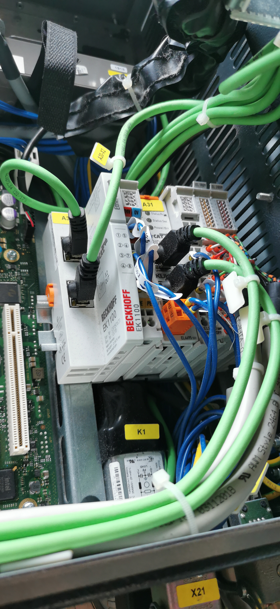
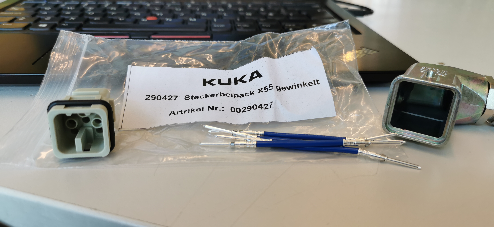

# Kuka robot

## Todo-Liste for Startup av KUKA'en

- Det kan være lurt å få en oversikt over dokumentasjonen som er her på github. For å finne ytterligere datablader og andre Kuka ressurser må du lage en konto på [Kuka Xpert](https://www.kuka.com/en-se/products/robotics-systems/software/cloud-software/kuka-xpert). [Her](https://xpert.kuka.com/ID/AR3605) er en gruppe med relevant informasjon om roboten.

- I sammenheng med sikkerhet må vi innstallere [WorkVisual](https://kuka.sharefile.eu/share/view/s0977718741844ab8/fo93cf61-6254-4154-bafd-37665fe3ad5f) for å drive med safe operation. Du kan finne video tutorials for WorkVisual [her](https://kuka.sharefile.eu/share/view/s2ceab2ffc3a4ce48/fode320a-d018-49b4-a809-d53effa3f83d).

## Integrasjon i Robotcelle skoleåret 2023/24 (Jakob og James)

### August2023: Setter i gang med kommunikasjonen mellom robotstyringen (KRC4 compact) og en Beckhoff PLS (CX9020) med remote I/O (RIO, EK1100) og safety over EtheCAT (FSoE).

29. august 2023: Fra manualen "MA KR C4 compact Interfaces V12"
  
 	
  
  

 ### Crash-sensor bypass switch

 [Dokumetert på egen side](crash_sensor_bypass.md)

# Tidligere Historikk Før sommeren 2023 (< Aug. 2023)

## Eivind og Dorde
Roboten heter **KR6 R700 sixx**.

Kontrolleren (styringen) er en **KR C4 compact**.

Håndkontrollen (pendant) er en **smartPAD** og kobles til styringen.

Roboten og styringen er begge utstyrt med en spesiell sikkerhetsfunksjon som heter **safe Operation**.

Maskinens harddrive er "flashet" (tatt et "image" / speilet harddisken) på en KUKA-USB James har.

For å finne datablader og andre Kuka ressurser må du lage en konto på [Kuka Xpert](https://www.kuka.com/en-se/products/robotics-systems/software/cloud-software/kuka-xpert). [Her](https://xpert.kuka.com/ID/AR3605) er en gruppe med relevant informasjon om roboten.

På roboten skal vi ha et sikkerhetssystem med sikkerhets PLS-er. Eksempelvis kan vi bruke [denne](https://industrial.omron.no/no/products/cip-safety) eller [denne](https://www.beckhoff.com/BK9105/). Her styres alt over en ethernetkabel som skal inn i port X66 på kontrolleren.

I sammenheng med sikkerhet må vi innstallere [WorkVisual](https://kuka.sharefile.eu/share/view/s0977718741844ab8/fo93cf61-6254-4154-bafd-37665fe3ad5f) for å drive med safe operation. Du kan finne video tutorials for WorkVisual [her](https://kuka.sharefile.eu/share/view/s2ceab2ffc3a4ce48/fode320a-d018-49b4-a809-d53effa3f83d).

## Eivind og Lukas

Stasjonen har blitt ryddet og alle kompoonenter som før var på buret er fjernet.

Mål er tatt opp for et nytt bur og noe grunnleggende planlegging er gjort.

Vi har også fått en grunnleggende innføring i programmering av roboten.

## Henrik, Wojtek, Storm og Danylo
Starta opp prosjekt med robotten 11.01.2022
Stasjonen har blitt ryddet 
Robotten funker som den skal men litt problemer med pneumatikken

# Selvsjekk

Roboten skal "sjekke seg selv" med jevne mellomrom. Dette må settes opp.

