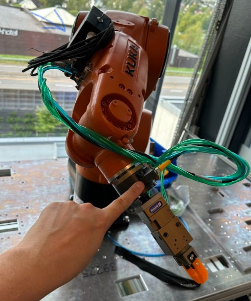
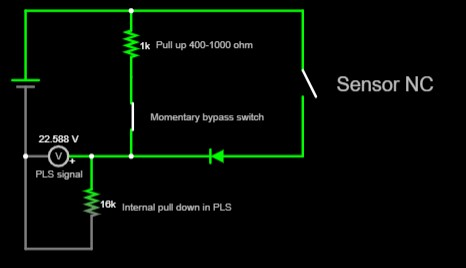

# KUKA robot crash sensor bypass

We need a bypass for this crash sensor, so that we can run the robot when it has triggered.

It is a 24V NC PNP signal, max 100mA. The sensor is expensive so we include a diode to protect it from being effected by reverse current.

EDIT: Replacing the diode with 1k resistor makes it safer, if somebody wires it wrong.

We have made a box for the connections, it has a momentary switch.

Crash_Sensor_NC

crash_sensor_triggerd

Crash_sensor_bypassed

[Falstad circuits code, download](Robot_crash_sensor_bypass.txt) and [Open in https://www.falstad.com/circuit/](https://www.falstad.com/circuit/)

Status: 

Avaiting the cable to connect to the robot.

Todo: 
* Solder cables to the center pin and the NO pin on the momentary switch.
* Wire up the connection from the robot to the PLC (when we get the cable)
* Add the resistor and diode. 
